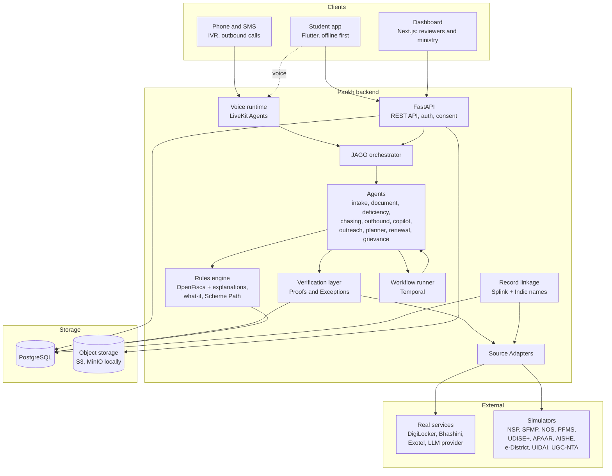

# Pankh

> **JAGO. Pankh pasaro.** (Wake up. Spread your wings.)

Pankh (पंख, "wings") is a unified, mobile-first scholarship platform for Scheduled Tribe (ST) students. It brings the five Ministry of Tribal Affairs (MoTA) scholarship schemes into one place, verifies student details against government registers instead of asking for the same papers again and again, and helps the ministry find eligible students who are not yet getting any benefit.

This README is the master plan: the problem, the ideas that make Pankh different, the design, and the build order. Shared vocabulary lives in [CONTEXT.md](CONTEXT.md). Individual decisions and their reasons live in [docs/adr/](docs/adr/).

---

## Contents

1. [The problem](#1-the-problem)
2. [What Pankh is](#2-what-pankh-is)
3. [What makes Pankh different](#3-what-makes-pankh-different)
4. [Design principles](#4-design-principles)
5. [System architecture](#5-system-architecture)
6. [The core engines](#6-the-core-engines)
7. [JAGO and the agents](#7-jago-and-the-agents)
8. [The student app](#8-the-student-app)
9. [The reviewer and ministry dashboard](#9-the-reviewer-and-ministry-dashboard)
10. [Data sources and integrations](#10-data-sources-and-integrations)
11. [Privacy, security and consent](#11-privacy-security-and-consent)
12. [Technology stack](#12-technology-stack)
13. [Repository layout](#13-repository-layout)
14. [Build phases](#14-build-phases)
15. [Costs](#15-costs)
16. [Access to apply for now](#16-access-to-apply-for-now)
17. [Running it locally](#17-running-it-locally)
18. [Open items](#18-open-items)

---

## 1. The problem

Problem Statement **26238**, Ministry of Tribal Affairs: *Unified Scholarship Mobile Application for Tribal Students* (Smart Automation).

MoTA runs five scholarship schemes for ST students, spread across three disconnected systems:

| Scheme | For | System of record |
|---|---|---|
| Pre-Matric | Class IX and X | National Scholarship Portal (NSP), via states |
| Post-Matric | Class XI onwards (UG, PG, diploma) | NSP, via states |
| Top Class (National Scholarship) | Students admitted to 265 notified premier institutions | Scholarship Fellowship Management Portal (SFMP, Canara Bank) |
| National Fellowship (NFST) | MPhil and PhD scholars | SFMP (Canara Bank) |
| National Overseas Scholarship (NOS) | Master's, PhD and postdoc study abroad | NOS Portal |

What goes wrong today:

- **No single view.** A student, or a family with children in different schemes, tracks applications, verification and payments in separate systems.
- **Only one scheme at a time.** A student may hold only one MoTA award at once, so they need to see their current status and eligibility together before applying for another.
- **Repeated manual verification.** Identity, ST or PVTG status, income, marks and institution details are checked by hand again and again, even though registers like DigiLocker, AISHE, UDISE+, APAAR, UIDAI, state e-District systems and UGC-NTA already hold them.
- **Eligible students left out.** Many ST students enrolled in school or college never apply, and the ministry cannot see who they are.

The problem statement asks for three things:

1. **A Scholarship Module:** one dashboard for all five schemes, from submission to verification to sanction and disbursement, with a DigiLocker-backed document wallet, reuse of past data, and a clear view of payments, DBT status, pending actions and deficiencies.
2. **The JAGO chatbot:** answers about eligibility, application status, documents, deficiencies and payments, specific to the student, in many languages, with timely alerts.
3. **A unified verification and integration layer:** connects the existing systems and government registers for automated or semi-automated verification, and sends exceptions to manual review instead of blocking the application.

---

## 2. What Pankh is

Three products share one backend:

- **The student app** (Android first, iOS from the same code): discover schemes, see a personal Scheme Path, apply with pre-filled data, track every application and payment across all three systems, and hold documents in one wallet. It works offline and by voice.
- **JAGO**: the single conversational front door, by text or voice, in the app and over a phone call. Behind it, specialist agents do the legwork.
- **The dashboard** for officials: review queues for each verification level (institute, district, state, ministry) and, for the ministry, a coverage map of eligible students who have not been reached.

Discovery is not limited to MoTA. Students can also find central and state schemes they qualify for (the Catalogue Schemes), judged by the same eligibility engine.

---

## 3. What makes Pankh different

Most submissions will build a dashboard, a document upload screen, a general-purpose chatbot, and a "verification API" box on a slide. Pankh's difference is a set of real engines that everything else runs on, plus agents that do real work for the student.

### 3.1 Eligibility as code, and a Scheme Path planner

Each scheme's rules are written as versioned, machine-checkable Rules. Every Rule cites the Guideline paragraph it comes from and the academic years it applies to. The engine does more than say yes or no:

- **Why:** a clause-by-clause breakdown, each with a link to the official paragraph.
- **What would change it:** "If your income certificate is re-issued under ₹2.5 lakh, you qualify."
- **What to plan for:** because a student may hold only one MoTA award at a time, the planner lays out a Scheme Path across years. For example: "Take Post-Matric now. In your final year, prepare for NFST, whose fellowship is worth more than Top Class on a PhD track."

When the ministry publishes an amendment, an AI drafts the changed Rules from the PDF and a person approves each one against its cited paragraph. The rules update in hours, and the previous academic year's applications are still judged by that year's rules.

### 3.2 Proofs instead of "verified" badges

The verification layer produces a signed **Proof** for each Fact: "ST status confirmed by e-District certificate X, checked on date Y, match score 0.97." Proofs are reused across schemes, so a student verifies once and applies anywhere. When a Fact cannot be confirmed or sources disagree, it becomes an **Exception** in a reviewer's queue with a suggested next step for the student. The application keeps moving.

### 3.3 Matching the same person across registers

Tribal names are written many ways: different transliterations, name order, no surname, "Kumari" and "Kumar" variants, different scripts. Pankh uses probabilistic record linkage (Splink) with Indic name normalisation and sound-alike comparison, weighing name, date of birth, district, school code and family details. Every Record Link carries the evidence for it. This one capability powers both exception triage and the ministry's search for Unreached Students, without joining records on Aadhaar numbers.

### 3.4 Finding the students nobody reached

Linking UDISE+, APAAR and OTR records against scholarship records reveals ST students who appear eligible but have never applied. The ministry sees them on a map by district and school, and the outreach agent sends each school's nodal officer a list with pre-computed eligibility, or contacts families directly in their language.

### 3.5 Built for how tribal areas actually work

- **Offline first:** everything except final submission works without a connection, and uploads resume where they stopped.
- **Voice first:** JAGO speaks Hindi, English, Odia, Marathi, Gujarati, Bengali and Santali, with recorded prompts in Gondi and Bhili for phone calls.
- **Feature phones:** students without smartphones can call JAGO, get SMS updates, and receive outbound calls.
- **Facilitators:** a teacher or field worker can register and help many students, with each student's recorded Consent.
- **Low-end devices:** tuned for a 2 GB RAM Android phone on a patchy 2G or 3G connection.

### 3.6 The Family view

One Guardian login shows every linked child's schemes, deadlines and money received. The problem statement mentions families explicitly, and it matters in households where one parent manages paperwork for several children.

### 3.7 "Where is my money?"

A **Disbursement Trace** follows each Instalment from Sanction through PFMS to the bank, ending in "credited" or "failed" with a plain-language reason. It also warns about common causes of failure before they happen, such as a bank account not linked to Aadhaar or an inactive account.

### 3.8 Agents that do the legwork

JAGO is backed by agents that pull records instead of asking, check document photos before submission, explain deficiencies and draft the letters to fix them, and chase stalled applications. See [section 7](#7-jago-and-the-agents).

---

## 4. Design principles

1. **Agents collect, explain and chase. Engines decide. Humans approve anything with consequences.** No language model decides eligibility or marks a Fact verified. Agents call the rules engine and the verification layer as tools and repeat their results with sources. Any outbound action to an official needs human approval.
2. **The best form is no form.** Pull Facts from registers first. Ask the student only for what is missing or contradictory, then read back what was found for confirmation.
3. **Never block, always route.** A mismatch becomes an Exception for a Reviewer, not a dead end for the student.
4. **Real where access exists, faithful where it does not.** Every Source System and Data Source sits behind a Source Adapter. Where we have real access, the adapter calls the real service. Elsewhere it calls a Simulator that follows the published interface. Swapping in the real service later changes the adapter only.
5. **Everything is explainable.** Every Eligibility Result, Proof, Record Link and agent action records its inputs, sources and reasons.
6. **Least data, least copies.** DigiLocker Documents are stored as references, not copies. Language models receive only the specific fields a task needs, never whole documents or Aadhaar numbers.
7. **Rules follow the calendar.** Every Rule has effective dates, and every judgment names the Rule Version it used.

---

## 5. System architecture



**How a request flows:**

- A student taps or speaks. The app calls the API, or streams audio to the voice runtime.
- JAGO works out what the student needs and hands off to the right agent.
- The agent uses tools: the rules engine for eligibility, the verification layer for Facts and Proofs, and Source Adapters for application status.
- Long-running work, such as "check back in 7 days, then nudge the institute", runs as a Temporal workflow that survives restarts and can wait for human approval.
- Events drive the system. When a Source System reports a stage change, the matching workflow wakes the right agent. A user tap is not required.

---

## 6. The core engines

### 6.1 Rules engine

- **Foundation:** OpenFisca, the open-source "rules as code" framework used by governments. It is Python, and it versions rule parameters over time natively.
- **Our layer on top:**
  - **Explanations:** clause-by-clause results with Guideline citations.
  - **What-if answers:** the smallest change of Facts that would flip a failing Rule.
  - **The Scheme Path planner:** searches sequences of schemes across the student's future years under the Exclusivity Rule, ranked by total benefit and likelihood.
- **Source material:** the official Guidelines, amendments, income revisions, fellowship rate revisions and the Top Class institute list published on [tribal.nic.in](https://tribal.nic.in/ScholarshiP.aspx). Catalogue Schemes are curated by hand in the same format.
- **Rule authoring tool:** an AI drafts Rules from a Guideline PDF, a person approves each Rule against its cited page and paragraph, and nothing goes live without sign-off.
- **Versioning:** Rule Versions are keyed by academic year, with effective dates for each amendment.

### 6.2 Verification layer

- **Input:** a Fact to confirm (for example, "ST status: Santhal, Jharkhand").
- **Routing:** picks the right Data Source for that Fact and state (for example, the e-District certificate for ST status, AISHE for institution, UGC-NTA for NET/JRF).
- **Comparison:** compares values with tolerance for spelling, transliteration and format differences, using the same name matching as record linkage.
- **Output:** a signed Proof (source, time, values compared, match score), or an Exception with a reason and a suggested fix.
- **Reuse:** Proofs are stored once and reused by every Application until they expire.
- **Coverage:** identity, ST and PVTG status, income, domicile, disability, academic records, institution, NET/JRF, bank account seeding, and overseas admission (for NOS).

### 6.3 Record linkage

- **Engine:** Splink, probabilistic record linkage used by UK government bodies.
- **Indic name handling:** script normalisation, transliteration to a common form, sound-alike keys, and handling of honorifics, missing surnames and name-order swaps.
- **Evidence:** every Record Link keeps its match weights, so a Reviewer can see why two records were judged the same person.
- **Uses:** Exception triage, duplicate detection across schemes, and finding Unreached Students.

### 6.4 Application tracker

- **One model** of an Application across NSP, SFMP and the NOS Portal, with a common set of Application Stages mapped from each system's own states.
- **Disbursement Traces** for each Instalment, with failure reasons translated into plain language.
- **Deficiencies** from Reviewers or Source Systems, each assigned to the deficiency agent.

---

## 7. JAGO and the agents

JAGO is the only door the student sees. Behind it, each agent has one job, a fixed set of tools, and a log of every action with its inputs and the Consent it relied on.

| Agent | What it does | Phase |
|---|---|---|
| **Intake** | Pulls Facts from DigiLocker and APAAR first, asks by voice or chat only for what is missing or contradictory, reads everything back for confirmation. Supports Facilitator-led registration. | 3 |
| **Document** | The student photographs a certificate. The agent identifies it, pulls out its fields, rejects blurry, cropped or expired images before submission, and compares the values with existing Proofs. | 2 |
| **Deficiency** | Explains a raised Deficiency in the student's language, gives the exact next step, and drafts any request needed (for example, to the tehsildar for a re-issued income certificate). | 4 |
| **Chasing** | Watches for stalled Applications (for example, "institute has not verified in 14 days") and sends Nudges to the responsible official, after human approval. | 4 |
| **Outbound voice** | Calls students without smartphones about important events, such as a failed Instalment, and walks them through the fix. | 6 |
| **Reviewer copilot** | Summarises a case's Proofs and highlights the exact mismatch for a Reviewer. The Reviewer decides. | 6 |
| **Outreach** | Runs district campaigns for Unreached Students in the local language, through schools and directly. | 6 |
| **Planner** | A conversational layer over the Scheme Path planner for "what if" questions. | 6 |
| **Renewal** | Pre-fills next year's Renewal and asks only what has changed. | 6 |
| **Grievance** | Files and tracks a grievance on CPGRAMS (the government's public grievance portal) when a payment is stuck past its deadline. | 6 |

**Guardrails:**

- Agents never write eligibility or verification outcomes. Only the engines do.
- Every answer JAGO gives about a student's own case is built from their records and the Rule text, with sources shown. JAGO does not guess.
- Any action with consequences (contacting an official, filing a grievance, submitting an Application) needs explicit approval from the student or a Reviewer.
- The language model is swappable. It receives the minimum fields a task needs, never whole documents or Aadhaar numbers.

**Voice:**

- One agent core serves in-app voice, incoming calls and outgoing calls.
- The voice runtime is LiveKit Agents. Speech recognition and speech output come from Bhashini (with AI4Bharat or Sarvam where they test better), chosen per language by testing on real recordings.
- For Gondi and Bhili, which current speech models do not cover well, phone calls use recorded prompts plus the state language.

---

## 8. The student app

**Main screens:**

- **Home:** what needs attention now (Deficiencies, deadlines, failed Instalments), then the status of every Application.
- **Discover:** every scheme the student qualifies for, with the clause-by-clause reason and what would change a "no" to a "yes". MoTA Schemes come first, then Catalogue Schemes.
- **My Scheme Path:** the recommended sequence of schemes across the student's future years.
- **Applications:** one timeline per Application, from draft through sanction to each Instalment, whichever Source System holds it.
- **Wallet:** Referenced and Uploaded Documents, each showing its Proof status.
- **Money:** every Instalment across every scheme, with Disbursement Traces.
- **JAGO:** chat and voice, always one tap away.
- **Family:** for Guardians, one card per linked child.

**Sign-in:** mobile number and OTP, with no passwords. "Link DigiLocker" both proves identity and pulls in Documents.

**Offline:** a local database holds the student's data and syncs when a connection returns. Actions taken offline are queued, and uploads resume where they stopped.

**Languages:** the whole interface, not only JAGO, in every launch language.

**Design:** built for low literacy. Icons and voice are always paired with text, the next step is always obvious, touch targets are large, and the app stays fast on low-end phones.

---

## 9. The reviewer and ministry dashboard

**For Reviewers (institute, district, state, ministry):**

- A queue of Exceptions and Deficiencies at their level, oldest and most urgent first.
- Each case shows its Proofs, the exact mismatch, the Record Link evidence and a copilot summary. The Reviewer approves, rejects or raises a Deficiency.
- Stalled work at a level is visible to the level above it.

**For the ministry:**

- **Coverage map:** Unreached Students by state, district and school, next to official beneficiary and fund figures.
- **Pipeline health:** how long each Verification Level takes, where Applications stall, and why Instalments fail.
- **Outreach console:** start and track campaigns for Unreached Students.
- **Rule authoring:** review AI-drafted Rules from new Guidelines and approve them against their cited paragraphs.

---

## 10. Data sources and integrations

### 10.1 Official data we already have

From the problem statement's data link, [tribal.nic.in/ScholarshiP.aspx](https://tribal.nic.in/ScholarshiP.aspx):

| Material | Examples | Used for |
|---|---|---|
| Scheme Guidelines and amendments | Pre-Matric (2022), Post-Matric, NFS and Top Class (2022, amended July 2023), NOS (2022, amended 2026-27), income ceiling revisions, fellowship rates from 1.1.2023, NET/JRF selection criteria from 2025-26 | Rules, with citations |
| Top Class institute list | Revised list of 265 institutes, 2023-24 onwards | Rules and institution checks |
| Beneficiaries and funds by state | Pre- and Post-Matric fund release and beneficiary counts, FY 2014-15 to 2025-26 (xlsx) | Coverage dashboard baseline |
| FAQs and instruction manuals | NFST, NOS, DigiLocker, Verification Module, Canara Bank (SFMP), UMANG | JAGO's grounding, and the reference for faithful Simulators |
| Live portals | dbttribal.gov.in, fellowship.tribal.gov.in, overseas.tribal.gov.in, scholarships.gov.in | Stage models and screens for Simulators |

The published selection lists name real students. Pankh does not load any personal data from them. Test and demo students are generated synthetically, and only aggregate public figures are used.

### 10.2 Real services versus Simulators

| System | How we connect |
|---|---|
| DigiLocker | Real, once partner access through API Setu is approved. Simulator until then. |
| Bhashini, AI4Bharat models | Real |
| Exotel (SMS and calls) | Real, once DLT sender and template registration is done |
| LLM provider | Real |
| NSP, SFMP (Canara Bank), NOS Portal | Simulator, built from the published manuals and portal flows |
| PFMS | Simulator |
| UDISE+, APAAR, AISHE, e-District, UIDAI, UGC-NTA | Simulator |

Every one of these sits behind a Source Adapter with a contract test. When real access arrives, the same tests run against the real service.

---

## 11. Privacy, security and consent

- **Data stays in India:** all storage and processing in an AWS India region, in line with the Digital Personal Data Protection Act 2023.
- **Consent ledger:** every pull of Facts and every action taken for a student records which Consent it relied on. Students can see and withdraw Consent.
- **Documents:** DigiLocker Documents are never copied, only referenced. Uploaded Documents are encrypted, stored privately, served only through short-lived links, and deleted on a retention schedule.
- **Language models:** the model receives the minimum fields a task needs, never whole documents or Aadhaar numbers.
- **Audit trail:** every Proof, Eligibility Result, Record Link and agent action is logged with its inputs and reasons.
- **Access control:** each Reviewer sees only their own jurisdiction and Verification Level.
- **No real personal data in development:** synthetic students only.

---

## 12. Technology stack

| Area | Choice |
|---|---|
| Student app | Flutter (Android first, iOS from the same code), offline-first local database |
| Dashboard | Next.js (TypeScript) |
| Backend | Python, FastAPI |
| Database | PostgreSQL |
| Object storage | S3 in production, MinIO for local development (same interface) |
| Authentication | Our own, in FastAPI: mobile number and OTP, DigiLocker link |
| Rules engine | OpenFisca, plus our explanation, what-if and planner layers |
| Record linkage | Splink, plus Indic name normalisation |
| Long-running workflows | Temporal |
| Voice | LiveKit Agents; Bhashini, AI4Bharat or Sarvam for speech |
| SMS and calls | Exotel |
| Language model | A cost-efficient, non-Claude provider behind one provider-neutral interface (see [open items](#18-open-items)) |
| Hosting | AWS India region, Docker |

The reasons behind the harder-to-reverse choices are in [docs/adr/](docs/adr/).

---

## 13. Repository layout

```
pankh/
├── README.md          this plan
├── CONTEXT.md         shared vocabulary
├── docs/adr/          decision records
├── mobile/            Flutter student app
├── backend/           FastAPI service: API, engines, agents
├── dashboard/         Next.js reviewer and ministry dashboard
├── rules/             scheme Rules and the official source manifest
├── simulators/        stand-ins for Source Systems and Data Sources (Phase 2)
└── infra/             Docker Compose and deployment
```

Folders are added when they first have real content.

---

## 14. Build phases

Each phase ends with something complete that can be demonstrated. Nothing is dropped; later phases build on earlier ones.

| Phase | Delivers |
|---|---|
| **1. Foundation** | Monorepo, local infrastructure, sign-in (mobile OTP), Student profile and Facts, the five MoTA Schemes as versioned Rules with citations, the rules engine with explanations and what-if, Discover in the app |
| **2. Verification** | Source Adapter framework and the first Simulators, the verification layer with Proofs and Exceptions, DigiLocker integration, the document agent, the Wallet |
| **3. JAGO and voice** | JAGO orchestrator, the intake agent, in-app voice in the launch languages, grounded answers with sources |
| **4. Tracking and money** | Application tracker across NSP, SFMP and NOS Simulators, Disbursement Traces, the deficiency and chasing agents on Temporal, Nudges, the Family view, Scheme Path planner |
| **5. Ministry** | Reviewer dashboard for all four levels, record linkage, Unreached Students, the coverage map with official aggregates, the rule authoring tool |
| **6. Reach** | Phone calls (incoming and outbound), recorded Gondi and Bhili prompts, reviewer copilot, outreach, planner, renewal and grievance agents |

Phases 1 to 3 alone go well beyond a typical submission.

---

## 15. Costs

Rough monthly figures, AWS Mumbai region.

| Item | Demo | District pilot (10,000 students) |
|---|---|---|
| Object storage (S3) | under $1 | about $3 |
| Language model (hosted, pay per use) | a few dollars | depends on provider; paid only for actual use |
| Speech (Bhashini) | free | free |
| Optional GPU for self-hosted speech models (g6.xlarge, only when needed) | none | up to about $590 |

A hosted language model is cheaper than running our own at every scale we expect, costs nothing when idle, and handles multi-step agent work far better than models small enough to self-host cheaply. Cloud startup credits (such as AWS Activate) typically cover a pilot.

---

## 16. Access to apply for now

These take weeks, so they start before the code needs them:

- [ ] **DigiLocker partner access** through API Setu
- [ ] **Bhashini** API key
- [ ] **Exotel** account, with **DLT** sender and template registration (required for SMS in India)
- [ ] **AWS** account in an India region, and **AWS Activate** (or similar) credits
- [ ] **Language model** provider account (provider still to be chosen)

---

## 17. Running it locally

What is built so far: the rules engine (all five MoTA Schemes, with citations), the backend
(sign-in, Facts, eligibility, DigiLocker verification with signed Proofs, application and
payment tracking, Reviewer queues, record linkage and coverage), the simulators, the student
app (questions, Discover, scheme details, Wallet, Applications) and the officials' dashboard.

**Needs:** Docker, [uv](https://docs.astral.sh/uv/), Flutter 3.38, Node 22.

```bash
# 1. Database (Postgres on port 5433, so it does not clash with a local Postgres)
docker compose -f infra/docker-compose.yml up -d --wait

# 2. Backend and simulators
uv sync --all-packages
cd backend && uv run alembic upgrade head && uv run python -m app.seed && cd ..
uv run --directory backend uvicorn app.main:app --port 8000 > api.log 2>&1 &
uv run --directory simulators uvicorn pankh_simulators.app:app --port 8100 &

# 3. Demo Students who link DigiLocker (sign-in codes are read from api.log)
uv run --directory backend python tools/demo_data.py --log ../api.log --count 12

# 4. Officials' dashboard on http://localhost:3000
cd dashboard && npm ci && npm run dev

# 5. Student app (Android phone over USB: forward the API and simulator ports first)
adb reverse tcp:8000 tcp:8000 && adb reverse tcp:8100 tcp:8100
cd mobile && flutter run --dart-define=PANKH_API_URL=http://localhost:8000
```

No SMS is sent in development: every sign-in code is written to the API log. The demo officials
are `+91 90000 00001` (ministry), `…02` (Jharkhand), `…03` (Dumka) and `…04` (Mayurbhanj).

**Checks:** `uv run ruff check && uv run pytest` (rules, backend, simulators),
`flutter analyze && flutter test` in `mobile/`, `npm run lint && npm run build` in `dashboard/`.
CI runs all of them on every push.

---

## 18. Open items

- **Language model provider.** Claude is ruled out for cost. Candidates to evaluate on our own test set of Indic, multi-step agent tasks: Sarvam (Indian, strong in Indic languages, data in India), Gemini Flash, DeepSeek and GPT mini-class models. The backend talks to models through one provider-neutral interface, so this choice can be made, and changed, by measurement.
- **Product name check.** Search trademarks and the Play Store before any public launch.
